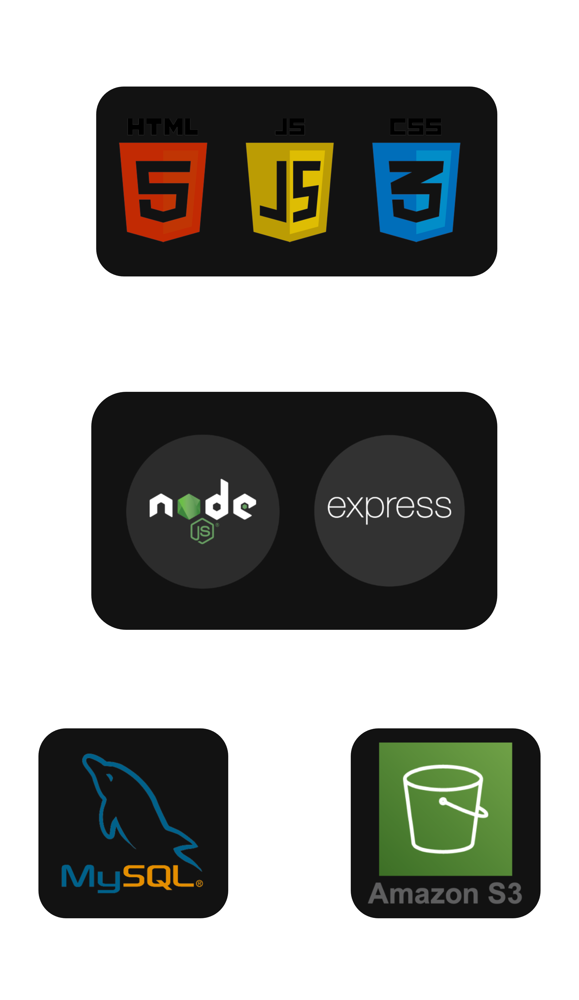

# 🎉 Sistema de Gerenciamento de Eventos


---

# 📌 1. Visão Geral do Projeto

O **Sistema de Gerenciamento de Eventos** é uma aplicação Web Full Stack desenvolvida com arquitetura Cliente-Servidor utilizando API REST, autenticação JWT, upload de arquivos e integração com Amazon S3.

O sistema permite:

- Cadastro e autenticação de usuários
- Gerenciamento completo de eventos (CRUD)
- Upload de arquivos
- Controle de acesso via JWT
- Persistência em banco de dados MySQL

---

# 🏗 2. Arquitetura do Sistema

<p align="center">
  
</p>

## Modelo Arquitetural

- Arquitetura Cliente-Servidor
- API REST
- Padrão MVC
- Autenticação baseada em JWT
- Integração com Amazon S3
- Separação de responsabilidades

---

# 🔙 3. Backend

Responsável por:

- Regras de negócio
- Autenticação e autorização
- Upload de arquivos
- Integração com AWS S3
- Persistência de dados

## 📂 Estrutura

```text
BackEnd
 ┣ 📂 models
 ┣ 📂 controllers
 ┣ 📂 routes
 ┣ 📂 middlewares
 ┣ 📂 config
 ┣ 📄 index.js
 ┗ 📄 .env
```

---

# 🛠 4. Dependências Utilizadas

## Principais Bibliotecas

### Express
Framework principal para criação da API REST.

### Sequelize
ORM para manipulação do banco de dados MySQL.

### Mysql2
Driver para conexão com MySQL.

### Dotenv
Carrega variáveis de ambiente a partir do arquivo `.env`.

### Cors
Permite requisições externas ao Backend (Cross-Origin Resource Sharing).

### Bcrypt
Criptografia e comparação de senhas usando hash seguro.

### Jsonwebtoken
Geração e validação de tokens JWT para autenticação.

### Multer
Middleware para upload de arquivos (`multipart/form-data`).

### @aws-sdk/client-s3
Integração com Amazon S3 para armazenamento e gerenciamento de arquivos.

---

# 🔗 5. Fluxo de Funcionamento

```text
[Usuário]
    ↓
[Frontend]
    ↓ HTTP Request
[Express]
    ↓
[Controller]
    ↓
[Sequelize]
    ↓
[MySQL]
    ↓
[Resposta JSON]
```

Para rotas protegidas:

```text
Login →
Geração de JWT →
Token enviado no Header →
Middleware valida token →
Acesso autorizado
```

Para upload:

```text
Frontend envia arquivo →
Multer processa →
Envio para Amazon S3 →
URL salva no banco
```

---

# 📬 6. Endpoints da API (Exemplo)

| Método | Rota | Protegida | Descrição |
|--------|------|-----------|------------|
| POST | `/login` | ❌ | Autenticação |
| GET | `/eventos` | ✅ | Listar eventos |
| POST | `/eventos` | ✅ | Criar evento |
| PUT | `/eventos/:id` | ✅ | Atualizar evento |
| DELETE | `/eventos/:id` | ✅ | Remover evento |

---

# 🗄 7. Banco de Dados

Banco relacional MySQL.

Conceitos aplicados:

- Entidade-Relacionamento
- Chaves Primárias
- Chaves Estrangeiras
- Integridade Referencial
- ORM (Sequelize)

---

# ⚙️ 8. Requisitos do Sistema

- Node.js 18+
- MySQL Server
- Conta AWS (para S3)
- Git
- VSCode (opcional)

---

# 🔐 9. Configuração do Arquivo `.env`

Criar um arquivo `.env` dentro da pasta **BackEnd** com o seguinte conteúdo:

```env
DATABASE_NAME="NOMEDATABELA"
DATABASE_USER="USUARIO"
DATABASE_PASS="SENHA"
DATABASE_HOST="localhost"

JWT_SECRET="CHAVESECRETA"

AWS_ACCESS_KEY_ID="ID"
AWS_SECRET_ACCESS_KEY="CHAVE"
AWS_REGION="us-east-2"
AWS_BUCKET_NAME="NOMEDOBUCKET"
```

---

## 📌 Descrição das Variáveis

### DATABASE_NAME
Nome do banco de dados criado no MySQL.

### DATABASE_USER
Usuário do banco de dados.

### DATABASE_PASS
Senha do banco de dados.

### DATABASE_HOST
Endereço do servidor MySQL (geralmente `localhost`).

### JWT_SECRET
Chave secreta utilizada para geração e validação dos tokens JWT.

### AWS_ACCESS_KEY_ID
Identificador da chave de acesso AWS.

### AWS_SECRET_ACCESS_KEY
Chave secreta AWS.

### AWS_REGION
Região do bucket S3 (exemplo: `us-east-2`).

### AWS_BUCKET_NAME
Nome do bucket criado na Amazon S3.

---

## ⚠️ Segurança

O arquivo `.env` **não deve ser enviado ao GitHub**.

Adicionar no `.gitignore`:

```text
.env
```

---

# 🚀 10. Como Executar o Projeto

## 1️⃣ Clonar repositório

```bash
git clone <URL_DO_REPOSITORIO>
```

---

## 2️⃣ Criar banco

```sql
CREATE DATABASE gerenciador_eventos;
```

---

## 3️⃣ Instalar dependências

```bash
cd gerenciador-eventos-BackEnd
npm install
```

---

## 4️⃣ Iniciar servidor

```bash
npm start
```

Servidor disponível em:

```text
http://localhost:3000
```

---

## 5️⃣ Executar Frontend

Abrir:

```text
index.html
```

Ou utilizar Live Server.

---

# 🧠 11. Conceitos Técnicos Aplicados

- API REST
- JWT Authentication
- Upload de arquivos
- Integração com Amazon S3
- Hash de senha (bcrypt)
- Middleware
- ORM
- Arquitetura MVC
- Variáveis de ambiente
- Separação de responsabilidades

---

# 📚 12. Informações Acadêmicas

**Instituição:** Instituto Federal do Piauí – IFPI  
**Curso:** Análise e Desenvolvimento de Sistemas – ADS  
**Professor:** Anderson Barros  

---

# 👥 13. Autores

- **Antonio Hittalo Ramyres P. R. Macedo**
- **Bento Kauê de Sousa Lima**
- **João Manuel da Silva Paulo**
- **José Nillo Marques Martins**

---

# 📈 14. Melhorias Futuras

- Deploy em produção
- Docker
- Testes automatizados
- CI/CD
- Monitoramento
- Documentação Swagger

---

# 📄 15. Licença

Projeto desenvolvido exclusivamente para fins acadêmicos.
